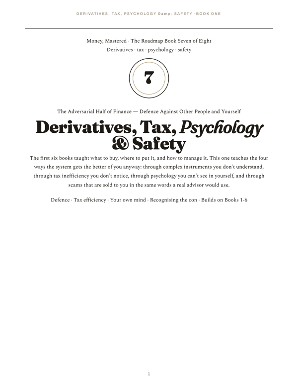

# Money, Mastered — a finance book series

> Premium, illustrated, deeply-researched finance books. Each is a single self-contained HTML file (broadsheet editorial design, embedded fonts and base64 images, works fully offline) with a matching print-ready PDF. Every chart is real market data; every formula has a worked calculation; every chapter has learning objectives and a self-check.

<p align="center">
  
  <br/>
  <em>From Book 1 — the real growth of $1 in the S&amp;P 500 from 1927 to today, with the future-value formula and a worked numeric calculation alongside.</em>
</p>

> **There's a styled landing page** at **[chethanbhatbs.github.io/money-mastered](https://chethanbhatbs.github.io/money-mastered/)** — covers, blurbs, one-click links to every book.

> ⚠️ **Education, not advice.** These books teach how money, markets and investing work in principle. They are **not** investment advice and recommend no specific security or product. Markets carry real risk including loss of capital; no return is guaranteed. Figures are illustrative. Verify current rules/figures for your country and situation, and consult a licensed/fiduciary professional before acting.

---

## The roadmap

The flagship effort is a progressive, beginner-to-confident series. Read in order; each book stands on the one before it. The series is published as **HTML (best reading experience)** and **PDF (print/offline)**.

|  | Stage | Book | Pages | Read | PDF |
|---|---|---|---:|---|---|
|  | **1 · Foundations** | **Book 1 — Money, From Zero** *(global)* | 66 | [Open](https://chethanbhatbs.github.io/money-mastered/book1-money-from-zero.html) | [PDF](https://chethanbhatbs.github.io/money-mastered/Book1-Money-From-Zero.pdf) |
|  | **1 · Foundations** | **Book 2 — Where to Put Your Money** *(global)* | 63 | [Open](https://chethanbhatbs.github.io/money-mastered/book2-where-to-put-your-money.html) | [PDF](https://chethanbhatbs.github.io/money-mastered/Book2-Where-to-Put-Your-Money.pdf) |
|  | **2 · The Markets** | **Book 3 — How the Market Works** *(India edition)* | 121 | [Open](https://chethanbhatbs.github.io/money-mastered/vol1-how-the-market-works.html) | [PDF](https://chethanbhatbs.github.io/money-mastered/Vol1-How-the-Market-Works.pdf) |
|  | **2 · The Markets** | **Book 4 — Fundamental Analysis** *(global)* | 94 | [Open](https://chethanbhatbs.github.io/money-mastered/book4-fundamental-analysis.html) | [PDF](https://chethanbhatbs.github.io/money-mastered/Book4-Fundamental-Analysis.pdf) |
|  | **2 · The Markets** | **Book 5 — Technical Analysis** *(global)* | **273** | [Open](https://chethanbhatbs.github.io/money-mastered/book5-technical-analysis.html) | [PDF](https://chethanbhatbs.github.io/money-mastered/Book5-Technical-Analysis.pdf) |
|  | **2 · The Markets** | **Book 6 — Funds, SIPs &amp; Portfolios** *(global)* | **93** | [Open](https://chethanbhatbs.github.io/money-mastered/book6-funds-sips-portfolios.html) | [PDF](https://chethanbhatbs.github.io/money-mastered/Book6-Funds-SIPs-Portfolios.pdf) |
|  | **2 · The Markets** | **Book 7 — Derivatives, Tax, Psychology &amp; Safety** *(global)* | **89** | [Open](https://chethanbhatbs.github.io/money-mastered/book7-derivatives-tax-psychology-safety.html) | [PDF](https://chethanbhatbs.github.io/money-mastered/Book7-Derivatives-Tax-Psychology-Safety.pdf) |
|  | **3 · Wealth** | **Book 8 — Building &amp; Protecting Wealth** *(capstone, global)* | **90** | [Open](https://chethanbhatbs.github.io/money-mastered/book8-building-and-protecting-wealth.html) | [PDF](https://chethanbhatbs.github.io/money-mastered/Book8-Building-and-Protecting-Wealth.pdf) |

### Companion volumes

|  | Book | Pages | Read | PDF | Notes |
|---|---|---:|---|---|---|
|  | **The Complete Money** — A Visual Encyclopedia of Finance, Wealth & Economics *(global)* | 143 | [Open](https://chethanbhatbs.github.io/money-mastered/the-complete-money.html) | [PDF](https://chethanbhatbs.github.io/money-mastered/The-Complete-Money.pdf) | Big-picture panorama: history, economics, crises, investing, psychology |
|  | **The Stock Market, From Scratch** *(India, one-book overview)* | 88 | [Open](https://chethanbhatbs.github.io/money-mastered/stock-market-india.html) | [PDF](https://chethanbhatbs.github.io/money-mastered/The-Stock-Market-From-Scratch.pdf) | Express overview of the Indian market |

---

## How to read (three options)

### 1 · In your browser
Click any **Open** link in the table above — it opens the rendered book straight from [chethanbhatbs.github.io/money-mastered](https://chethanbhatbs.github.io/money-mastered/). No login, no download required.

### 2 · As a PDF (print or offline)
Click any **PDF** link. The PDFs are print-ready (broadsheet margins, running headers/footers, page numbers) and open in any PDF reader, on any device.

### 3 · Mobile
The HTML files are responsive — they re-flow for phone screens. The PDFs work on every mobile PDF reader; the HTML usually reads more comfortably.

---

## Hosting

The site is live at **[chethanbhatbs.github.io/money-mastered](https://chethanbhatbs.github.io/money-mastered/)** (served via GitHub Pages — proper `text/html` content-types, PDFs preview inline). The Read/PDF links in the roadmap table above use these URLs. Every `git push` to `main` auto-redeploys.

### Alternative URLs (if needed)

If GitHub Pages is ever unavailable, the same files render via:

- **htmlpreview.github.io** — `https://htmlpreview.github.io/?https://github.com/chethanbhatbs/money-mastered/blob/main/book5-technical-analysis.html`
- **raw.githack.com** — `https://raw.githack.com/chethanbhatbs/money-mastered/main/book5-technical-analysis.html`
- **Cloudflare Pages / Netlify** — deploy configs are already in `netlify.toml`, `_headers`, and `_redirects` for a custom domain. See [DEPLOY.md](DEPLOY.md).

> *(Avoid `cdn.jsdelivr.net` for HTML — they serve it as `text/plain`, which makes browsers show the source instead of rendering.)*

---

## Design

Broadsheet editorial style — Fraunces (display), Spectral (text), Archivo (furniture); ink-on-warm-paper with a single gold accent; original vector diagrams **plus** real rendered charts (using `mplfinance` against real market data); photographs used under free licences (Wikimedia Commons), embedded as base64. Each chapter carries learning objectives and a self-check; each book includes a glossary and concept index.

**Book 5 (Technical Analysis)** is the largest in the series at **264 pages, 45 chapters across 10 parts + 3 reference appendices, ~56,100 words, 38 real charts** built from real market data (S&P 500, AAPL, NFLX, META, TSLA, Nifty 50, Reliance Industries). Every figure is independently verifiable (the Charts Index back-matter lists every chart, instrument and date range). The book ships a Python companion (Ch 38) with code for every indicator, a 60+ exercise workbook (Ch 37) with full answer keys, a Common Mistakes appendix (Ch 43), and a Quick Reference Card (Ch 44) distilling every formula and rule onto a single chapter.

---

## What’s in each book

**Book 1 — Money, From Zero** *(global)*
What money is, why fiat works, inflation as a silent tax, savings vs investing, compounding (with the FV formula and a real 95-year S&P 500 chart), risk vs reward, the order of operations.

**Book 2 — Where to Put Your Money** *(global)*
Cash · bonds (with see-saw math) · stocks (with total-return calc) · funds (with a worked expense-ratio drag calc showing how a 1% fee costs ~22% of a 30-year portfolio) · property · gold/alternatives · diversification · dollar-cost averaging (worked calc).

**Book 3 — How the Market Works** *(India edition, in ₹)*
The company, the share, IPOs, exchanges, the order book, SEBI, depositories, clearing & settlement (T+1), brokers, indices (with worked free-float calc), market cap, corporate actions, surveillance, contract-note costs (worked itemised cost of a ₹50,000 trade), and real Nifty/Reliance charts.

**Book 4 — Fundamental Analysis** *(global)*
Income statement · balance sheet · cash flow · valuation (P/E, P/B, DCF, DuPont) · moats and competitive advantage · margin of safety · a real worked Apple FY2023 analysis appendix using actual SEC data.

**Book 5 — Technical Analysis** *(global)*
The encyclopedic volume. Foundations, candlesticks (every pattern on real scanned data), chart patterns, indicators with the full math and Python code, risk management, six historical case studies (1929/1987/2000/2008/2020/2022), the deep schools (Dow/Wyckoff/Elliott/Ichimoku/P&F), specialised techniques (harmonic patterns/volume profile/Heikin-Ashi/Renko), backtesting done properly, a 60+ exercise workbook with full answers, and the Python companion with code for every indicator.

**Book 6 — Funds, SIPs & Portfolios** *(global)*
Portfolio foundations (MPT, risk-adjusted return), asset allocation (three-fund, glide paths), implementation (ETFs, factor investing, SIPs, rebalancing), tax-efficient investing (asset location, TLH), decumulation (4% rule, dynamic withdrawal, sequence-of-returns risk), and a complete worked retirement plan.

**Book 7 — Derivatives, Tax, Psychology & Safety** *(global)*
The defensive book. Derivatives without the mystique (forwards, futures, options, the four positions, the Greeks, what survives scrutiny, how derivatives go wrong); tax without the headache (income, capital gains short-term vs long-term, tax-advantaged accounts revisited, TLH in practice, international and estate); psychology — your real adversary (the dozen costliest biases, emotional cycles in markets, the IPS-driven anti-fragile habit stack); safety — recognising the cons (the five universal markers, Ponzi/pyramid, modern variants from rug pulls to pig-butchering, the salesperson disguised as advisor); and a closing defensive framework that pulls the four threads into a single checklist.

**Book 8 — Building & Protecting Wealth** *(capstone, global)*
The capstone of the series. The wealth equation (income × savings rate × time, with worked tables showing why savings rate dominates returns); net worth and the ratios that matter; debt as accelerator vs destroyer; the emergency fund; the big life decisions (buy vs rent with the 5% rule, insurance against ruin, career capital as your largest asset, children and education); the life-cycle decades (20s systems, 30s-40s accumulation, the 50s consolidation decade, decumulation done right in the 60s+); estate planning, generational wealth (the Williams-Preisser causes of failure), philanthropy (DAFs, CRTs, effective giving), and the three legacies; and closing with the question of enough plus a single-page synthesis across all eight books.

---

## How to reproduce the charts

Every chart in Book 5 is generated from real data. To re-fetch and re-render:

```bash
# Create a virtualenv with the charting stack
python3 -m venv .chartenv
.chartenv/bin/pip install pandas numpy matplotlib mplfinance yfinance pdf2image

# The scripts that generate the charts live in charts/
# Data is fetched from Nasdaq's chart API and yfinance, saved to chartdata/
.chartenv/bin/python charts/gen_book5_a.py   # golden cross, gap, S/R, uptrend
.chartenv/bin/python charts/gen_book5_b.py   # candlestick pattern scans
.chartenv/bin/python charts/gen_book5_c.py   # anatomy, RSI div, MACD, Bollinger
# ... see the charts/ directory for the full set
```

Every formula in Book 5 has a copy-paste Python implementation in Chapter 38 (the Python Companion).

---

## Notes

- *Money, From Zero* and *Where to Put Your Money* are **global** (use `$` as a stand-in for any currency).
- The **Indian-edition** volumes (Book 3, *The Stock Market From Scratch*) use ₹ and Indian institutions (NSE/BSE/SEBI), grounded in SEBI/NSE/BSE/RBI sources.
- All prose is original; freely-licensed photographs (Wikimedia Commons) are the only third-party content and are credited in-book.
- Charts are built from publicly available historical data via Nasdaq's chart API and yfinance; the chart-rendering code in `charts/` and the Python Companion in Book 5 Chapter 38 reproduce every figure.
