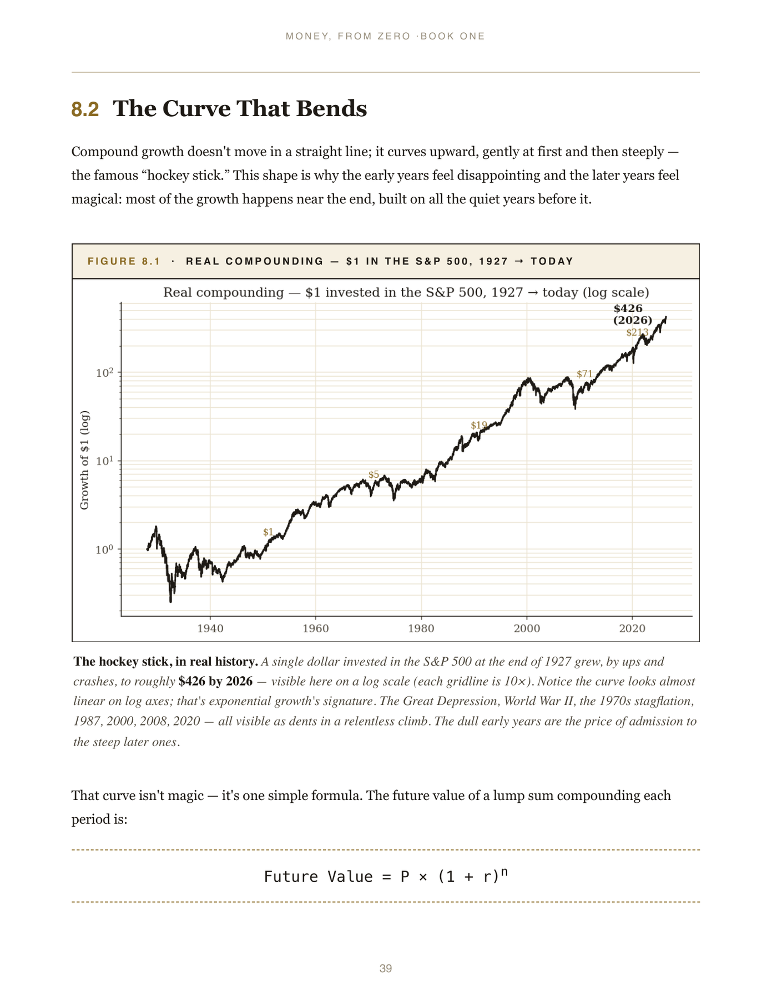
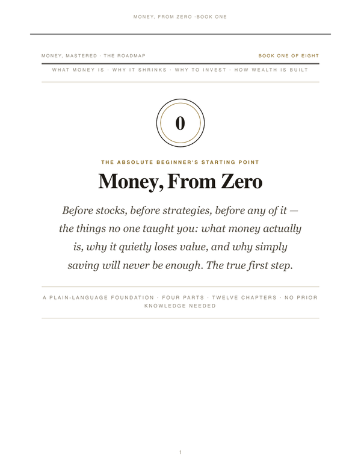
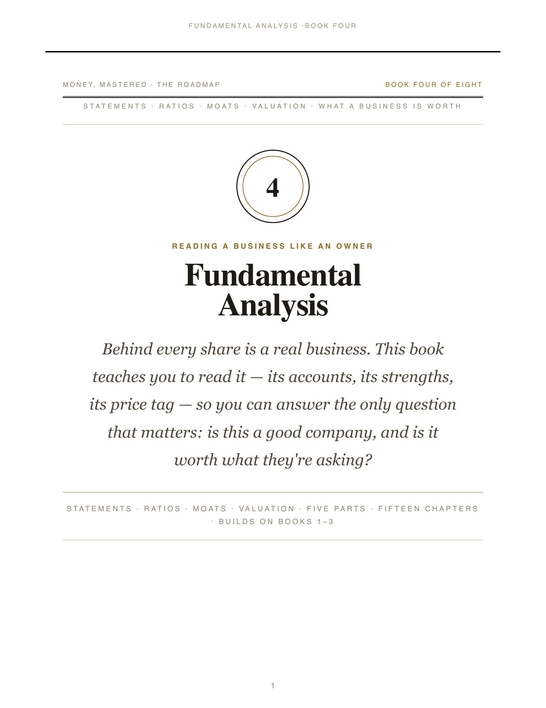
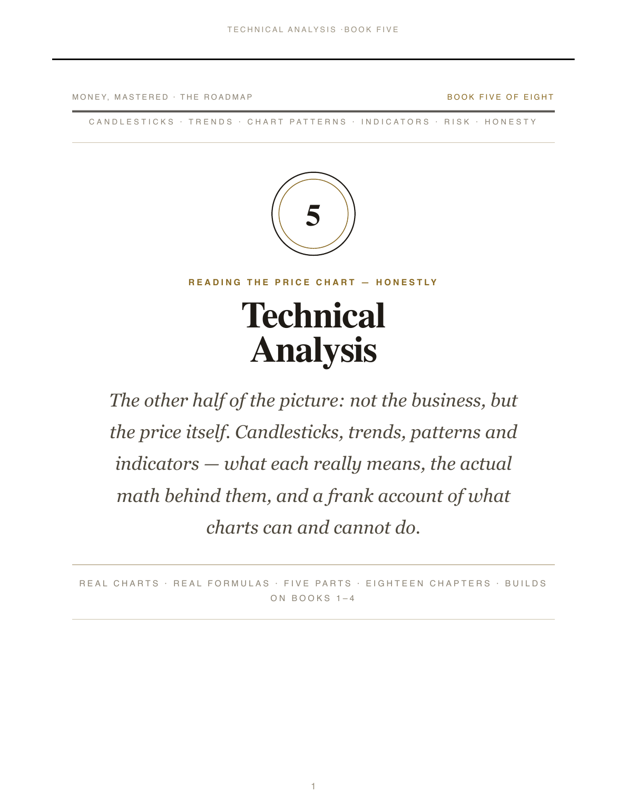

# Money, Mastered — a finance book series

> Premium, illustrated, deeply-researched finance books. Each is a single self-contained HTML file (broadsheet editorial design, embedded fonts and base64 images, works fully offline) with a matching print-ready PDF. Every chart is real market data; every formula has a worked calculation; every chapter has learning objectives and a self-check.

<p align="center">
  
  <br/>
  <em>From Book 1 — the real growth of $1 in the S&amp;P 500 from 1927 to today, with the future-value formula and a worked numeric calculation alongside.</em>
</p>

> **There's also a landing page.** Open [`index.html`](index.html) for a styled overview with covers and one-click links to every book.

> ⚠️ **Education, not advice.** These books teach how money, markets and investing work in principle. They are **not** investment advice and recommend no specific security or product. Markets carry real risk including loss of capital; no return is guaranteed. Figures are illustrative. Verify current rules/figures for your country and situation, and consult a licensed/fiduciary professional before acting.

---

## The roadmap

The flagship effort is a progressive, beginner-to-confident series. Read in order; each book stands on the one before it. The series is published as **HTML (best reading experience)** and **PDF (print/offline)**.

|  | Stage | Book | Pages | View HTML | Download PDF |
|---|---|---|---:|---|---|
|  | **1 · Foundations** | **Book 1 — Money, From Zero** *(global)* | 66 | [Open](book1-money-from-zero.html) | [PDF](Book1-Money-From-Zero.pdf) |
|  | **1 · Foundations** | **Book 2 — Where to Put Your Money** *(global)* | 63 | [Open](book2-where-to-put-your-money.html) | [PDF](Book2-Where-to-Put-Your-Money.pdf) |
|  | **2 · The Markets** | **Book 3 — How the Market Works** *(India edition)* | 121 | [Open](vol1-how-the-market-works.html) | [PDF](Vol1-How-the-Market-Works.pdf) |
|  | **2 · The Markets** | **Book 4 — Fundamental Analysis** *(global)* | 94 | [Open](book4-fundamental-analysis.html) | [PDF](Book4-Fundamental-Analysis.pdf) |
|  | **2 · The Markets** | **Book 5 — Technical Analysis** *(global)* | **273** | [Open](book5-technical-analysis.html) | [PDF](Book5-Technical-Analysis.pdf) |
|  | **2 · The Markets** | **Book 6 — Funds, SIPs &amp; Portfolios** *(global)* | **93** | [Open](book6-funds-sips-portfolios.html) | [PDF](Book6-Funds-SIPs-Portfolios.pdf) |
| — | 2 · The Markets | Book 7 — Derivatives, Tax, Psychology & Safety | — | *Planned* | — |
| — | **3 · Wealth** | Book 8 — Building & Protecting Wealth | — | *Planned* | — |

### Companion volumes

|  | Book | Pages | View HTML | Download PDF | Notes |
|---|---|---:|---|---|---|
|  | **The Complete Money** — A Visual Encyclopedia of Finance, Wealth & Economics *(global)* | 143 | [Open](the-complete-money.html) | [PDF](The-Complete-Money.pdf) | Big-picture panorama: history, economics, crises, investing, psychology |
|  | **The Stock Market, From Scratch** *(India, one-book overview)* | 88 | [Open](stock-market-india.html) | [PDF](The-Stock-Market-From-Scratch.pdf) | Express overview of the Indian market |

---

## How to read (three options)

### 1 · Read in your browser (the best experience)
Click any **Open** link in the tables above while signed in to GitHub. GitHub shows the source by default; to actually render the HTML, see *“Browser preview”* below — or download the file and open it locally (it’s a single self-contained HTML file with fonts and images embedded, no network needed).

### 2 · As a PDF (print or offline)
Click any **Download PDF** link. The PDFs are print-ready (broadsheet margins, running headers/footers, page numbers). They open in any PDF reader, on any device.

### 3 · Mobile
The HTML files are responsive — they re-flow for phone screens. Download the file and open in your phone’s browser. PDFs work on every mobile PDF reader; the HTML often reads more comfortably.

---

## Browser preview (rendering HTML, not source)

GitHub natively shows HTML as **source code**, not rendered. To preview the HTML books in a real browser, you have a few options depending on your visibility setting:

### If this repo is **private** (current state)
Direct browser preview through third-party services (`htmlpreview.github.io`, `raw.githack.com`) **does not work** for private repos — they can’t see your files.

The practical options while private:
- **Clone the repo and double-click the HTML file locally.** Each file is fully self-contained (offline-capable, fonts and images embedded as base64).
- **Use the GitHub web UI**: open the file, click the **Raw** button, then **Save Page As…** to download the HTML.

### If you make this repo **public**
Each HTML book becomes one-click previewable in any browser via either:

- **htmlpreview.github.io** (free, third-party, public repos only)
  `https://htmlpreview.github.io/?https://github.com/chethanbhatbs/money-mastered/blob/main/book5-technical-analysis.html`
- **raw.githack.com** (similar)
  `https://raw.githack.com/chethanbhatbs/money-mastered/main/book5-technical-analysis.html`

### If you want a permanent public URL while keeping the repo private

**Everything is already configured.** This repo contains `index.html` (a styled landing page listing every book), plus `netlify.toml`, `_headers`, and `_redirects` that both Netlify and Cloudflare Pages auto-detect. You just need to click through one deploy flow:

→ **[See DEPLOY.md for step-by-step instructions](DEPLOY.md)** (Cloudflare Pages, Netlify, GitHub Pages, or just make it public — all four options documented).

The recommended path — **Cloudflare Pages** — takes about three minutes and gives you a permanent URL like:

```
https://money-mastered.pages.dev/
https://money-mastered.pages.dev/book5             (short alias)
https://money-mastered.pages.dev/Book5-Technical-Analysis.pdf
```

Every `git push` to `main` auto-redeploys.

---

## Design

Broadsheet editorial style — Fraunces (display), Spectral (text), Archivo (furniture); ink-on-warm-paper with a single gold accent; original vector diagrams **plus** real rendered charts (using `mplfinance` against real market data); photographs used under free licences (Wikimedia Commons), embedded as base64. Each chapter carries learning objectives and a self-check; each book includes a glossary and concept index.

**Book 5 (Technical Analysis)** is the largest in the series at **264 pages, 45 chapters across 10 parts + 3 reference appendices, ~56,100 words, 38 real charts** built from real market data (S&P 500, AAPL, NFLX, META, TSLA, Nifty 50, Reliance Industries). Every figure is independently verifiable (the Charts Index back-matter lists every chart, instrument and date range). The book ships a Python companion (Ch 38) with code for every indicator, a 60+ exercise workbook (Ch 37) with full answer keys, a Common Mistakes appendix (Ch 43), and a Quick Reference Card (Ch 44) distilling every formula and rule onto a single chapter.

---

## What’s in each book

**Book 1 — Money, From Zero** *(global)*
What money is, why fiat works, inflation as a silent tax, savings vs investing, compounding (with the FV formula and a real 95-year S&P 500 chart), risk vs reward, the order of operations.

**Book 2 — Where to Put Your Money** *(global)*
Cash · bonds (with see-saw math) · stocks (with total-return calc) · funds (with a worked expense-ratio drag calc showing how a 1% fee costs ~22% of a 30-year portfolio) · property · gold/alternatives · diversification · dollar-cost averaging (worked calc).

**Book 3 — How the Market Works** *(India edition, in ₹)*
The company, the share, IPOs, exchanges, the order book, SEBI, depositories, clearing & settlement (T+1), brokers, indices (with worked free-float calc), market cap, corporate actions, surveillance, contract-note costs (worked itemised cost of a ₹50,000 trade), and real Nifty/Reliance charts.

**Book 4 — Fundamental Analysis** *(global)*
Income statement · balance sheet · cash flow · valuation (P/E, P/B, DCF, DuPont) · moats and competitive advantage · margin of safety · a real worked Apple FY2023 analysis appendix using actual SEC data.

**Book 5 — Technical Analysis** *(global)*
The encyclopedic volume. Foundations, candlesticks (every pattern on real scanned data), chart patterns, indicators with the full math and Python code, risk management, six historical case studies (1929/1987/2000/2008/2020/2022), the deep schools (Dow/Wyckoff/Elliott/Ichimoku/P&F), specialised techniques (harmonic patterns/volume profile/Heikin-Ashi/Renko), backtesting done properly, a 60+ exercise workbook with full answers, and the Python companion with code for every indicator.

---

## How to reproduce the charts

Every chart in Book 5 is generated from real data. To re-fetch and re-render:

```bash
# Create a virtualenv with the charting stack
python3 -m venv .chartenv
.chartenv/bin/pip install pandas numpy matplotlib mplfinance yfinance pdf2image

# The scripts that generate the charts live in charts/
# Data is fetched from Nasdaq's chart API and yfinance, saved to chartdata/
.chartenv/bin/python charts/gen_book5_a.py   # golden cross, gap, S/R, uptrend
.chartenv/bin/python charts/gen_book5_b.py   # candlestick pattern scans
.chartenv/bin/python charts/gen_book5_c.py   # anatomy, RSI div, MACD, Bollinger
# ... see the charts/ directory for the full set
```

Every formula in Book 5 has a copy-paste Python implementation in Chapter 38 (the Python Companion).

---

## Notes

- *Money, From Zero* and *Where to Put Your Money* are **global** (use `$` as a stand-in for any currency).
- The **Indian-edition** volumes (Book 3, *The Stock Market From Scratch*) use ₹ and Indian institutions (NSE/BSE/SEBI), grounded in SEBI/NSE/BSE/RBI sources.
- All prose is original; freely-licensed photographs (Wikimedia Commons) are the only third-party content and are credited in-book.
- Charts are built from publicly available historical data via Nasdaq's chart API and yfinance; the chart-rendering code in `charts/` and the Python Companion in Book 5 Chapter 38 reproduce every figure.
